<picture>
  <source media="(max-width: 600px)" srcset="assets/header-mobile.svg">
  
</picture>

  <a href="#currently-building">Current work</a> &nbsp; / &nbsp;
  <a href="#selected-projects">Projects</a> &nbsp; / &nbsp;
  <a href="#research-focus">Research</a> &nbsp; / &nbsp;
  <a href="#connect">Connect</a>

### `SYSTEM://PROFILE`

I'm **Anirudh**, a Computer Science Engineering student in **Bengaluru, India**. I build across AI, computer vision, remote sensing, and full-stack development—taking research ideas into usable software.

**Current focus:** intelligent systems with clear evidence, reliable inference, and thoughtful product interfaces.

## Currently building

<a href="https://github.com/AnirudhShashikumar/SatQuery-AI">
  <picture>
    <source media="(max-width: 600px)" srcset="assets/satquery-mobile.svg">
    
  </picture>
</a>

**Earth observation, with the evidence attached.**

SatQuery AI brings natural-language queries, single-image analysis, optical + SAR fusion, and bi-temporal change analysis into one evidence-oriented remote-sensing workflow.

- **Observe:** Sentinel-1 SAR, including VV / VH polarization, and Sentinel-2 optical imagery.
- **Analyze:** visual question answering, spatial grounding, and change detection through specialist models and a FastAPI backend.
- **Investigate:** Pix2Pix and experimental SARFusionFormer for SAR-to-optical translation. Generated optical-like imagery remains distinct from observed sensor data.

`Python` `PyTorch` `Transformers` `FastAPI` `Computer Vision`

[Explore the repository ↗](https://github.com/AnirudhShashikumar/SatQuery-AI)

## Selected projects

<table>
<tr><td>
01 / FULL-STACK SYSTEMS
<h3><a href="https://github.com/AnirudhShashikumar/Dayflow">Dayflow ↗</a></h3>

<strong>A complete workspace for the working day.</strong> HRMS spanning employee self-service, attendance, leave, payroll, and document workflows.

Employee, HR, and admin access is enforced across application routes and PostgreSQL row-level security, with audit history and automated tests.

<code>Next.js</code> <code>TypeScript</code> <code>Supabase</code> <code>PostgreSQL</code> <code>Vitest</code>

</td></tr>
</table>

<table>
<tr><td>
02 / APPLIED AI
<h3><a href="https://github.com/AnirudhShashikumar/MediFit">MediFit ↗</a></h3>

<strong>Health information, connected and understandable.</strong> An AI-assisted health application exploring medication interactions, lab-report insights, and personalized fitness workflows.

Connects a Gemini-powered Python backend to a typed React interface, with medication-context analysis and multimodal report parsing.

<code>React</code> <code>TypeScript</code> <code>Python</code> <code>FastAPI</code> <code>Gemini</code>

</td></tr>
</table>

<table>
<tr><td>
03 / VISION × INTERACTION
<h3><a href="https://github.com/AnirudhShashikumar/gesture-globe">Gesture Globe ↗</a></h3>

<strong>A world you can move with your hands.</strong> A browser-based 3D Earth controlled through real-time hand landmarks and gestures.

Maps palm movement, pinch, and two-hand gestures into smooth globe rotation and scale, connecting computer vision to an interactive graphics system.

<code>MediaPipe</code> <code>Three.js</code> <code>Next.js</code> <code>TypeScript</code>

</td></tr>
</table>

## Research focus

**From visual signals to intelligent systems.**

- **Perception:** computer vision, deep learning, and remote-sensing representations.
- **Generation:** transformers, generative models, and image-to-image translation.
- **Reasoning:** multimodal AI, evidence fusion, and temporal change understanding.
- **Deployment:** inference APIs, evaluation workflows, and AI-assisted software development.

## Engineering stack

**AI / ML** &nbsp; Python · PyTorch · Transformers · MediaPipe  
**Backend** &nbsp; FastAPI · REST APIs · Pydantic  
**Frontend** &nbsp; React · Next.js · TypeScript · JavaScript  
**Data & deployment** &nbsp; Supabase · PostgreSQL · Vercel  
**Development** &nbsp; Git · GitHub · Vitest

## Recognition

| Result | Event |
| :--- | :--- |
| **1st / 130 teams** | Inception 2.0 · GDG |
| **3rd place** | Push, Pull, Commit · IEEE Computer Society, BMSIT&M |

## GitHub activity

[View my contribution history and recent work ↗](https://github.com/AnirudhShashikumar?tab=overview)

Explore the contribution snake

<picture>
  <source media="(prefers-reduced-motion: reduce)" srcset="assets/generated/contributions-static.svg">
  <source media="(prefers-color-scheme: dark)" srcset="assets/generated/contributions-dark.svg">
  
</picture>

Refreshed daily from GitHub's contribution calendar. The animation is a visualization, not a performance metric.

## Connect

**Let's build systems that see, reason, and act.**

[LinkedIn ↗](https://www.linkedin.com/in/anirudh-shashikumar) &nbsp; / &nbsp; [Email ↗](mailto:Anirudh.shashikumar@gmail.com) &nbsp; / &nbsp; [GitHub ↗](https://github.com/AnirudhShashikumar)

Portfolio: to be added

<!-- Maintainer setup and source notes: docs/PROFILE-MAINTENANCE.md. -->
